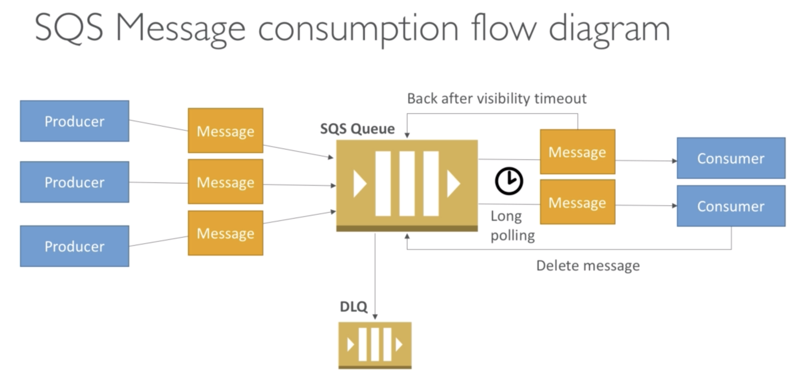

# SQS

## Simple Queue Service

* 프로듀서는 큐에 메시지를 전달한다.
* 컨슈머는 메시지를 폴링한다.
* 메시지 처리량을 초당 1 ~ 10000건까지 스케일링한다.
* 메시지는 기본 4일 보관하고 최대 보존기한은 14일이다.
* 큐 메시지 보존개수는 제한이 없다
* 10ms 내외의 레이턴시

## Delay Queue

메시지를 컨슈머에게 전달하는 것을 최대 15분까지 지연시킨다.

## Consumer

* 컨슈머는 한번에 최대 10건의 메시지를 폴링한다.
* Visibility timout 동안 메시지를 처리한다.

## Visibility Timeout

* 폴링한 메시지는 큐에서 사라지는게 아니다. visibility timeout 동안 다른 컨슈머에게 보이지 않는다
* 기본 30초 최대 12시간 
  * 타임아웃이 길면, 재처리하는데 오랜 시간이 걸린다.
  * 타임아웃이 너무 짧으면 메시지가 중복 처리될 수 있다.
* ChangeMessageVisibility API는 메시지 처리 중에 visibility 상태를 변경한다.
* DeleteMessage API는 SQS에게 메시지가 성공적으로 처리되었음을 알린다.

## Dead Letter Queue

* 메시지 처리가 실패하면 메시지는 다시 큐로 돌아간다.
* Redrive policy(재처리회수) 동안 메시지는 컨슈밍을 반복한다.
* 임계치를 초과하면 Dead letter queue에 들어간다.

## Long polling

* 메시지를 폴링하는데 최대 20초까지 기다린다.
* 롱 폴링은 API 호출 회수를 줄인다.
* WaitTimeSeconds API를 사용해서 기능을 활성화한다.

## FIFO Queue

* 큐 이름은 `.fifo`로 끝나야 한다.
* 스탠다드 큐에 비해 처리량이 낮다. (초당 최대 3000건)
* 메시지는 순서대로 처리된다
* Deduplication ID 로 메시지 중복을 체크한다.
* Deduplication: 메시지 중복 처리가 없다
